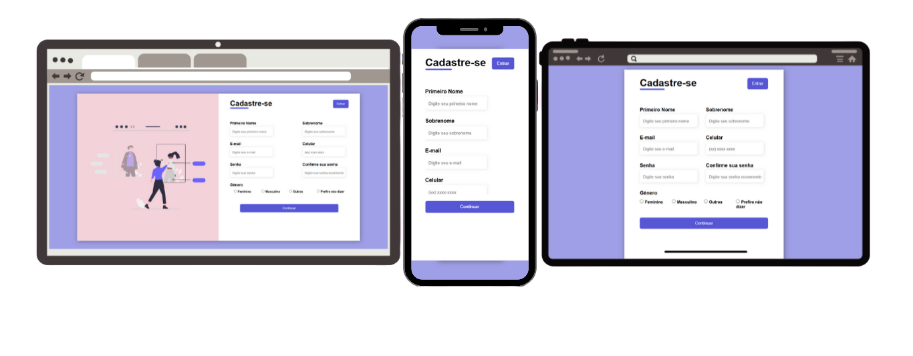

 <h1 align="center">
 formulario-cadastro
 </h1>

<h1 align="center"> <a href="https://hellenpaula.github.io/formulario-cadastro/">Veja o site aqui! </a></h1>

## 📷 Preview do projeto:
<h1 align="center"> </h1>

## 📌 Sobre

**Formulário de Cadastro** é um projeto desenvolvido com foco no estudo de HTML5 e CSS3, com ênfase na aplicação de Media Queries para tornar a página responsiva em diferentes tamanhos de tela (desktop, tablet e celular).

## 📚  Aprendizados
Durante o desenvolvimento deste projeto, pude colocar em prática conceitos importantes de **HTML** e **CSS**, com foco em:

- Estruturação de formulários em HTML, utilizando diferentes tipos de inputs (texto, e-mail, senha, telefone e radio buttons).  
- Organização do layout com **Flexbox**, aplicando espaçamentos, alinhamentos e responsividade.  
- Estilização de botões, labels e campos de entrada, utilizando **hover**, **focus** e sombras para melhorar a usabilidade.  
- Implementação de **Media Queries** para adaptar o formulário a diferentes tamanhos de tela (desktop, tablet e mobile).  
- Separação do conteúdo (HTML) da apresentação (CSS), seguindo boas práticas de desenvolvimento.  

Esse projeto me ajudou a reforçar conceitos de **responsividade**, **design limpo** e **experiência do usuário** em páginas web.

## 🔨 Ferramentas
- [HTML5](https://developer.mozilla.org/pt-BR/docs/Web/HTML)
- [CSS3](https://developer.mozilla.org/pt-BR/docs/Web/CSS)
- [Media Queries](https://developer.mozilla.org/pt-BR/docs/Web/CSS/CSS_media_queries/Using_media_queries)

